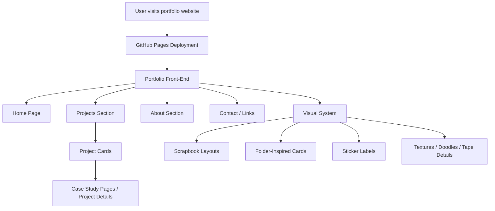
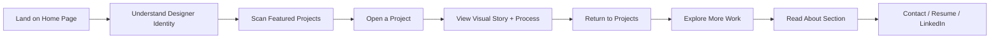
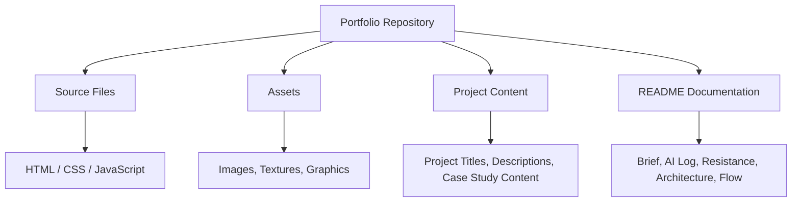

# Niharika Jain — Portfolio Website

A personal portfolio website designed to present my work across UI/UX design, visual communication, branding, product thinking, and AI-assisted design workflows.

This portfolio is not intended to feel like a generic clean template. It is built as a playful, expressive, and organized digital archive of my creative work — a space where projects feel like files, artifacts, notes, and collected moments from my design process.

Live Site:
https://niharika12002.github.io/niharikajain.portfolio/

---

## Brief

The goal of this website is to create a recruiter-friendly portfolio that still feels personal, memorable, and visually expressive.

The site is designed to communicate:

* Who I am as a multidisciplinary UI/UX and graphic designer
* My strongest project work
* My process, thinking, and visual design sensibility
* My ability to create systems that feel clear, thoughtful, and emotionally engaging

The portfolio balances two needs:

1. **Professional clarity** — recruiters should be able to understand my work quickly.
2. **Personal expression** — the website should feel playful, whimsical, and specific to my design personality.

---

## Visual Direction

The visual direction is inspired by a **digital scrapbook / desktop archive / organized chaos** aesthetic.

The site is meant to feel like a smart designer’s creative desktop: expressive, layered, intentional, and easy to navigate.

### Key Visual Ideas

* Folder-inspired project cards
* Desktop archive and file-system references
* Collage-style image treatments
* Sticker labels and small visual tags
* Tape, paper textures, and scrapbook details
* Playful underlines and doodle arrows
* Colorful accent moments
* Mixed artifact-style project layouts
* Less explanatory text and more visual storytelling

### Design Balance

The site should feel:

* Playful, but not childish
* Expressive, but not messy
* Personal, but still professional
* Visual, but still easy to scan
* Whimsical, but structured enough for recruiters

Each project should feel like its own artifact rather than a repeated card in a grid.

---

## AI Direction Log

AI was used as a creative and technical partner throughout the website development process.

The role of AI was not to replace design decision-making, but to help explore directions, generate structure, refine language, and speed up iteration.

### How AI Was Used

| Stage               | AI Contribution                                                             |
| ------------------- | --------------------------------------------------------------------------- |
| Visual Exploration  | Helped define the scrapbook / desktop archive direction                     |
| Art Direction       | Generated visual references and layout language for the site                |
| UX Structure        | Helped keep the navigation and project organization recruiter-friendly      |
| Copywriting         | Assisted in reducing text-heavy sections and making the tone more personal  |
| Development Support | Helped translate design direction into website structure and implementation |
| Iteration           | Supported critique, feedback, and refinement of visual hierarchy            |

### AI Prompting Direction

The core prompt direction focused on making the site feel more playful, personal, and visually expressive while keeping the UX clear.

Example direction used:

> Push the visual system toward a digital scrapbook / desktop archive / organized chaos aesthetic. Use folder-inspired project cards, collage-style image treatments, sticker labels, playful underlines, doodle arrows, tape, paper textures, and colorful accent moments. Keep the UX structure clear and recruiter-friendly underneath. Do not make it messy or childish.

---

## Record of Resistance

Throughout the process, I actively pushed back against design directions that felt too generic, too polished, or disconnected from my personality as a designer.

### What I Resisted

* A standard clean portfolio template
* Overly minimal layouts with no personality
* Text-heavy case study sections
* Identical project cards
* Generic corporate UI styling
* Visual systems that felt too safe or predictable
* A scrapbook style that became too messy or childish
* Overexplaining projects instead of letting visuals carry the story

### Why I Resisted It

A portfolio should not only show finished work. It should also communicate taste, personality, decision-making, and creative confidence.

For this reason, I wanted the site to feel more like a curated creative archive than a traditional portfolio page.

The final direction keeps the structure clear, but adds visual storytelling through layers, textures, labels, and artifact-based project presentation.

---

## System Architecture

The portfolio is structured as a static front-end website hosted through GitHub Pages.

### Main System Parts

| Part             | Purpose                                                       |
| ---------------- | ------------------------------------------------------------- |
| Home Page        | Introduces my identity, tone, and visual personality          |
| Projects Section | Presents selected work as distinct creative artifacts         |
| Project Pages    | Provide deeper context, process, and outcomes                 |
| About Section    | Gives background, skills, and design interests                |
| Contact Links    | Makes it easy for recruiters or collaborators to reach me     |
| Visual System    | Creates the playful desktop archive aesthetic across the site |

---

## System Flow

The user flow is designed to help recruiters and visitors quickly understand who I am, explore my work, and contact me.

### Intended Visitor Experience

1. The visitor lands on the homepage and immediately gets a sense of my personality.
2. They scan the project archive and see a range of design work.
3. Each project feels visually distinct and artifact-like.
4. The visitor can quickly understand the project type, role, and outcome.
5. They can move deeper into selected case studies without feeling overwhelmed by text.
6. The site ends with clear contact pathways for professional opportunities.

---

## Design Principles

### 1. Organized Chaos

The site can feel layered and expressive, but the underlying structure must stay clear.

### 2. Visual First

Projects should communicate through imagery, hierarchy, and composition before relying on long blocks of text.

### 3. Personal, Not Random

Every decorative element should feel intentional and connected to the portfolio’s creative desktop concept.

### 4. Recruiter-Friendly

Even with a playful visual style, the site should remain easy to skim, navigate, and understand.

### 5. Artifact-Based Storytelling

Projects should feel like different kinds of creative files, not identical portfolio cards.

---

## Project Structure

---

## Future Improvements

Future updates may include:

* Replacing placeholder project content with final case study details
* Adding more refined project visuals and mockups
* Creating individual case study pages for each major project
* Improving responsiveness across screen sizes
* Adding subtle motion and hover interactions
* Refining accessibility, alt text, and keyboard navigation
* Optimizing image loading and performance

---

## Reflection

This portfolio is both a professional website and a personal design system.

The biggest challenge was finding the right balance between clarity and personality. I did not want the site to become either too plain or too chaotic. The final direction aims to show my work in a way that feels expressive, thoughtful, and intentional while still making it easy for recruiters to understand my skills and projects.

AI helped accelerate exploration, but the creative direction, critique, resistance, and final decisions were guided by my own design judgment.
