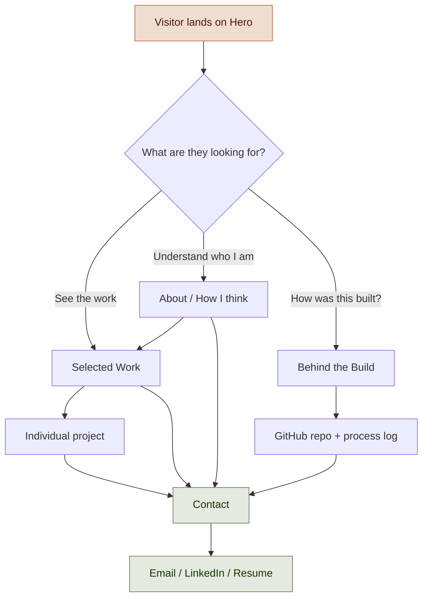
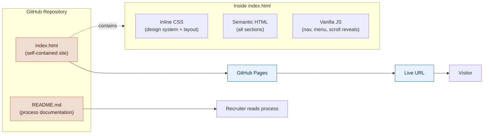

# Niharika Jain — Portfolio

> **Part designer, part storyteller, part systems thinker.**

🔗 **Live site:** _add your GitHub Pages URL here once enabled_

---

## 📌 Brief

This is my personal portfolio as a UX and Graphic Designer — but it's also a project *in* the portfolio.

Most portfolios show you the finished work. This one also shows you the thinking behind it. I built this site using AI as a creative collaborator, and I documented the entire process: the prompts I wrote, the directions I gave, the moments I pushed back, and the decisions I made along the way.

The goal is twofold:
1. **Present my work** as a designer who cares equally about systems, storytelling, and craft.
2. **Demonstrate how I work with AI** — not as a shortcut, but as a tool I direct with intention and critique.

The core idea guiding every decision: *transforming messy ideas into thoughtful experiences that people can navigate, understand, and connect with.*

---

## 🤖 AI Direction Log

A record of how I directed the AI throughout this project. AI proposed; I decided.

| Version | Date | What I asked for | What AI generated | What I directed |
|---------|------|------------------|-------------------|-----------------|
| v0.1 | _date_ | Wrote a detailed design brief defining personality, tone, visual direction, and structure | — (this was entirely me) | The full creative foundation: voice, mood, what to avoid |
| v0.2 | _date_ | "Build a homepage that feels like my brief" | Editorial homepage — serif/sans pairing, terracotta accent, two-column hero | Reviewed layout, refined copy tone, adjusted the hero |
| v0.3 | _date_ | "Build the full multi-page framework" | A complete React + Vite + Tailwind app with routing and components | Directed component structure, content, and organization |
| v0.4 | _date_ | "Simplify to one HTML file + one README for GitHub Pages" | Single self-contained `index.html` + this documentation | Chose the simpler architecture; defined what the README must contain |

> **How to use this log:** Add a new row every time you iterate. Keep the "What I directed" column honest — that column is the evidence of *your* design judgment.

**My working framework with AI:**

- **I use AI for:** generating initial layouts, scaffolding code, drafting copy, exploring directions, structuring information, debugging.
- **I direct:** all creative decisions, the visual system, typography, UX structure, storytelling, and final editing.
- **I reject:** generic layouts, buzzword-heavy copy, weak hierarchy, off-brand visuals, and anything that doesn't feel like *me*.

---

## 🛑 Record of Resistance

The moments I pushed back against the AI. This is the most important section — it's where the design actually happened. *Knowing what to keep, change, and throw away is the design.*

| # | AI suggested / produced | My resistance | What I did instead |
|---|--------------------------|---------------|--------------------|
| 1 | _e.g. A generic centered hero with a stock layout_ | _Felt like a template, not like me_ | _Asked for an asymmetric editorial split with the tagline as the headline_ |
| 2 | _e.g. Buzzword-heavy intro copy_ | _Sounded corporate, not human_ | _Rewrote in plain, conversational language_ |
| 3 | _add your own_ | | |
| 4 | _add your own_ | | |

> **Tip:** Fill this in as you go. Even small disagreements count — "I didn't like this shade of orange so I changed it" is a real design decision worth recording. Recruiters want to see that you have a point of view, not that you accept the first thing handed to you.

---

## 🔄 System Flow Diagram

How a visitor moves through the site, and the decision points along the way.



**The thinking:** Every path leads to contact, but visitors arrive with different goals. A recruiter wants the work first. A creative director might want to understand how I think. Someone curious about AI in design goes straight to the build log. The flow respects all three without forcing a single linear path.

---

## 🎨 Visual Direction & Design Goal

**Goal:** A warm, editorial creative studio — translated into a digital experience. It should feel personal, intelligent, refined, and human. Designed *through* typography and layout rather than heavy effects.

**Typography**
- Display / headlines: **DM Serif Display** — expressive, editorial, confident
- Body / UI: **DM Sans** — clean, modern, highly readable
- Typography is the strongest visual element. Large headlines, generous spacing, clear hierarchy.

**Color palette**

| Role | Color | Hex |
|------|-------|-----|
| Background | Cream | `#F5F2EC` |
| Primary text | Ink (espresso) | `#1C1A16` |
| Secondary text | Soft ink | `#4A4640` |
| Accent | Terracotta | `#C4673A` |
| Soft accent bg | Terracotta light | `#F0DDD2` |
| Secondary accent | Sage | `#6B7B5E` |

**Mood:** Editorial · Warm · Contemporary · Intentional · Refined · Human · Organized · Curious · Subtly playful.

**Deliberately avoiding:** neon AI aesthetics, cyberpunk, dark futuristic tech styling, startup-bro design, generic templates, overly minimal white pages, corporate language, chaotic animation.

**Interaction:** Soft hover states, gentle scroll reveals, smooth scrolling, a subtle animated scroll hint. Nothing flashy — polish that supports usability, never distracts from it.

---

## 🏗️ System Architecture

How the site is built. I deliberately chose the simplest architecture that meets the goal: a single self-contained HTML file, hosted free on GitHub Pages, no build step.



**Why this architecture:**

- **One HTML file** — no framework, no build, no dependencies to break. The whole site is in one place I fully understand and can edit by hand.
- **Inline CSS with a design-token system** — colors and fonts are defined once as CSS variables (`--cream`, `--ink`, `--terra`) and reused everywhere, the same way a design system works in Figma.
- **Vanilla JavaScript** — handles only what's needed: sticky nav, mobile menu, and scroll-triggered reveals. No libraries.
- **GitHub Pages hosting** — free, automatic, and the live URL sits right next to the source code and process log. The medium reinforces the message: the work and the thinking live together.

### File structure
```
niharikajain.portfolio/
├── index.html      ← the entire live site
└── README.md       ← this file: brief, AI log, resistance, diagrams, direction
```

---

---

*Built by Niharika Jain · 2026*
